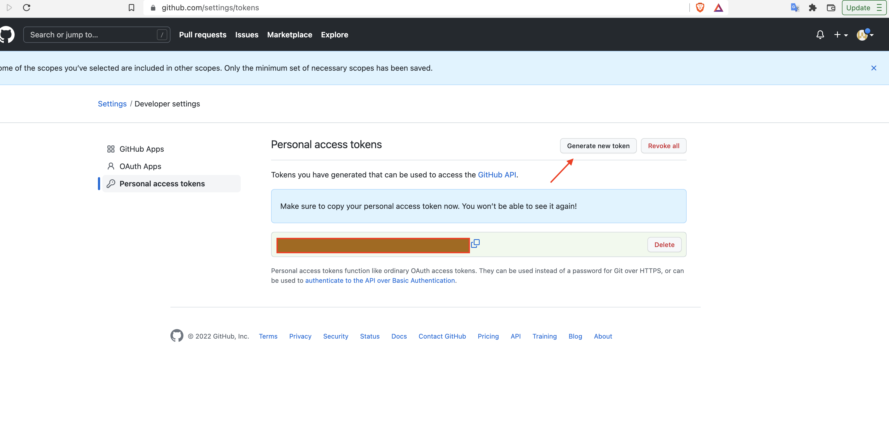
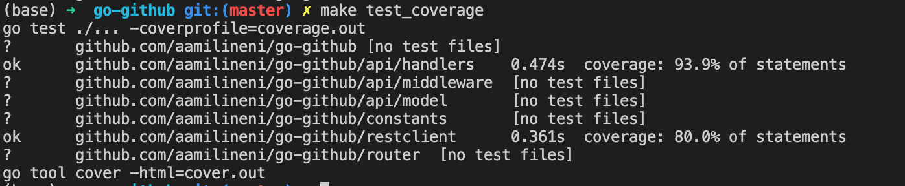

# go-github

go-github is a simple web application helps in getting the github user & repo information. 
It is written using <a href="https://github.com/gin-gonic/gin"><strong>Gin Web Framework</strong></a> to make server high performant


## Contents
- [Go Github](#go-github)
  - [1. Usage](#usage)
  - [2. Design Pattern](#1-design-pattern)
  - [3. Middleware](#2-middleware)
  - [4. Frameworks](#3-frameworks)
  - [5. About App](#4-about-app)
  - [6. Performance Metrics](#performance-metrics)
  - [7. Limitations](#limitations)

## 1. Usage

To install go-github, you need to install [Go](https://golang.org/)(**version 1.12+ is required**) and set your Go workspace.

Clone the project

```
$ cd <path of the project>
$ cp .env.default .env
```

Add the value to the `GITHUB_AUTH_TOKEN` key from the 

To obtain the Github Auth Token which is required for the Github API authentication, otherwise we get the rate-limiting error fromt the Github API's as the requests/hour is less without github authentication

Refer the below URLs for more information:
<div>
https://docs.github.com/en/rest/guides/getting-started-with-the-rest-api
</div>


Get the token from Github->Settings->Personal Access Token->Generate new




After adding the auth token to your `.env` file, it should look something like below

```
GITHUB_AUTH_TOKEN=<github-personal-access-token>
```

This project uses go modules and provides a make file. You should be able to simply install and start:

```
$ make build_and_run
```

Once you run the app, to health check you can make the following cURL

```
curl --location --request GET 'http://localhost:8080/v1/healthcheck'
```

To run all the test cases written

```
$ make test
```


To run test coverage

```
$ make test_coverage
```


This project also supports Docker, to run the app using docker 

```
$ docker build -t go-github .  
$ docker run --publish 8000:8000 go-github
```

This Project supports Swagger. To run the Swagger UI, simply run the project and open the swagger UI 

```
$ make swagger
$ make build_and_run
```
And hit the `http://localhost:8080/swagger/index.html` URL in browser.

## 2. Design Pattern

Since we are using the Gin web framework, we made the application rest api routes very easy.

Project structure is as follows


## 3. Middleware

Out of the box Gin web framework allows you to add the middleware functions and also it provides basic functionality of logging the API's.

Added the middleware to intercept the requests going through the go-github service to check whether the request has the valid header for key `Accept` with value as `application/json` otherwise the middleware will throw 406 response status code.


## 4. Frameworks
Using the below frameworks in this project:
1. <a href="https://github.com/gin-gonic/gin"><strong>Gin Web Framework</strong></a>
2. <a href="https://github.com/stretchr/testify"><strong>Stretchr Framework for Test Cases</strong></a>
3. <a href="https://github.com/joho/godotenv"><strong>godotenv for loading .env variables</strong></a>


## 5. About App
Go-Github service gets the Github Repos information from the PUBLIC API's given by github.com and it is designed to be scalable in the future

Request API:
http://localhost:8080/v1/{user_name}/repos

Example cURL:
```
curl --location --request GET 'http://localhost:8080/v1/aamilineni/repos' --header 'Accept: application/json'
```

Unit test cases are covered for handlers & restclient. 



## 6. Performance Metrics
Benchmarking for this application is not done.
<p align="justify"><i>"As this application uses Gin web framework, the default logs of Gin server shows how much time is consumed by each request to send response back."</i></p>


## 7. Limitations
1. No authentication added to api routes and the server is running on http mode.
2. Not included CloudFormation scripts 
3. Not added the Jenkins Pipeline


